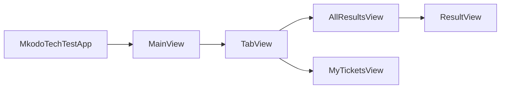

# Mkodo Technical test

Hi! My name is Adriano and this is my submission for the Tech Test for the Senior iOS Software Engineer position at Mkodo.

## Tech Stack
- Swift
- SwiftUI
- Built with the latest Xcode
- Observation Framework
- XCTest (The new swift testing framework would have been nice to use but I wanted to complete the work in the latest non-beta release of Xcode)

## Decision process

### Essential tasks
1. **Parse JSON Data**: Load and parse the provided JSON data within the app
    - Models are decodable.
    - Since we don't have an endpoint to hit, I thought it would be a good idea to create a protocol that would describe the desired behaviour of fetching the data. Then I created a class that would fetch the data from a local JSON file which could easily be switched with another class to hit an endpoint if that we
2. **Display Lottery Draws**: Create a simple view that lists all lottery draws with their respective draw dates.
    - Initially I simply displayed the lottery draw numbers with the dates underneath but it wasn't easy to read because all of the numbers were close together. I decided to display each number of the draw in a circle mimicking the style of the lottery balls. I used this as an opportunity to demonstrate knowledge of ViewModifiers.
3. **Unit and Integration Testing**: Write tests to cover critical functionalities of the application.
    - Testing the data fetching was crucial here. I tested that the input data did decode correctly.

### Additional tasks
4. **Detail View for Each Draw**: Implement a detail view for each lottery draw, showing all numbers and the bonus ball.
    - I re-used components from the List to display to show the lottery result.
    - ViewModifier was used to setup the prize amount. I did this because it seemed like a style that we would want to match in other places in the larger context of the product.
5. **Lottery Tickets**: Implement a 'ticket view' that shows some randomly generated lottery tickets and if they have won or not.
    - Randomly generating a random ticket gave me too many questions:
        - To what draw would these tickets belong to?
        - When is that draw?
        - How do I calculate that the ticket has won if there is no draw?
    - I tried to create what would look like a realistic scenario look like. 
        - We would have old tickets that are a part of a draw that has already taken place. 
        - We would also have new tickets that haven't been drawn yet.
        - We would probably hit a tickets endpoint to get the data. Similarly to the results, I have created a model for a ticket that has a ticketId and a drawId. We can compare with the results data to associate which tickets belong to which draw.
        - Similarly to the results data I have stubbed the tickets data in a JSON file. Also, I have created a facade that we can swap out 
6. **Navigation**: Add basic navigation from the main list view to the detail views of each draw.
    - I embedded the AllResultsView and MyTicketsView in a TabView.
    - The ResultDetailsView is also a NavigationLink which will push itself onto the NavigationStack.
    - I thought the default navigation behaviours would be suitable to show the content.
7. **Additional Tests**: Add more thorough testing and improve test coverage.
    - Code coverage is **92%**
    - I focused on covering edge cases with tests.
    - The Ticket models are tested to make sure that we are fetching and decoding the data correctly.
    - I also had to test the ordering of the data was consistent (most recent first). 
    
    
--------------- 
#### Tasks yet to be completed
8. **Interactive Navigation**: Implement swipe gestures to navigate between different draw details.
9. **Local Storage**: Cache the lottery draws locally and allow the app to display the cached data when offline.
10. **UI/UX Enhancements**: Enhance the visual presentation and user experience of the app using animations or custom UI components.

## App Architecture

I thought about what architecture would be suitable here and I ended up going with the "keep it simple" approach. Since there are only 3 screens that get shown to the user. I thought it wouldn't be right to over engineer the architecture. If more complex behaviour would be needed or if we were going to extrapolate the tech test into a more comprehensive app, I would at that point consider fitting in a coordinator pattern or even the TCA pattern.

