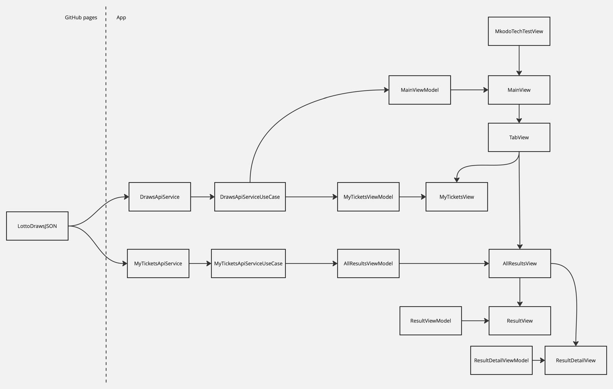

# Mkodo Technical Test

Hi! My name is Adriano, and this is my submission for the technical test for the Senior iOS Software Engineer position at Mkodo.

## Tech Stack
- Swift
- SwiftUI
- Built on Xcode 15.4
- Observation Framework
- XCTest (The new swift testing framework would have been nice to use but I wanted to complete the work in the latest non-beta release of Xcode)

## Decision Process

### App Architecture

From the outset I have a few things in mind:
- Keep it simple
- Are you going to need it?

I thought about what architecture would be suitable here and I ended up going with the "keep it simple" approach. Since there are only three screens that get shown to the user. I thought it wouldn't be right to over engineer the architecture. If more complex behaviour were needed or if we were going to extrapolate the tech test into a more comprehensive app, I would at that point consider changing the architecture to be a coordinator pattern or even the TCA pattern.

#### Final Architecture

### Essential tasks
1. **Parse JSON Data**: Load and parse the provided JSON data within the app
    - Since we don't have an endpoint to hit, I thought it would be a good idea to create a protocol that would describe the desired behaviour of fetching the data. In the unit tests I am able to create a class that conforms to the `DrawsApiServiceUseCase` protocol and I can read the data from JSON files. I then uploaded the stub data to github ( https://github.com/agimenez95/LottoDrawsJSON ). This way I was able to get the data as if I were hitting an endpoint. 
2. **Display Lottery Draws**: Create a simple view that lists all lottery draws with their respective draw dates.
    - I made the `Draw` model `Identifiable` and displayed the lottery draws in a `List` in `AllResultsView`. 
3. **Unit and Integration Testing**: Write tests to cover critical functionalities of the application.
    - Testing the data fetching was crucial here. I tested that the input data did decode correctly.
    - From the stub data, I also checked that the correct values were being sent to the views from the view models.
    - I also made a `Spy` to ensure simplify the test and to check that the `getData()` function always called `getLottoResults()` regardless of the rest of the implementation. 

### Additional tasks
4. **Detail View for Each Draw**: Implement a detail view for each lottery draw, showing all numbers and the bonus ball.
    - I embedded the views in `AllResultsView` in a `NavigationStack`. 
    - The `ResultView`'s were also embedded in a `NavigationLink` so that the `ResultDetailView` could get pushed onto the `NavigationStack`.
    - I re-used components from the List to display to show the lottery result. 
5. **Lottery Tickets**: Implement a 'ticket view' that shows some randomly generated lottery tickets and if they have won or not.
    - Randomly generating a random ticket gave me too many questions:
        - To what draw would these tickets belong to?
        - When is that draw?
        - How do I calculate that the ticket has won if there is no draw?
    - What would a realistic scenario look like: 
        - We would have old tickets that are a part of a draw that has already taken place. 
        - We would also have new tickets that haven't been drawn yet.
        - We would probably hit a tickets endpoint to get the data. Similarly to the results, I have created a model for a ticket that has a ticketId and a drawId. We can compare with the results data to associate which tickets belong to which draw.
        - I created ticket data that I have stubbed in a JSON file (and also uploaded it to the same github repo I mentioned earlier). Also, I created a facade that defines the behaviour of the apiService called `MyTicketsApiServiceUseCase`. I tested the service similarly to the `DrawsApiService`.
6. **Navigation**: Add basic navigation from the main list view to the detail views of each draw.
    - I embedded the `AllResultsView` and `MyTicketsView` in a `TabView`.
    - The `ResultDetailsView` is also a `NavigationLink` which will push itself onto the `NavigationStack`.
    - I thought the default navigation behaviours would be suitable to show the content.
7. **Additional Tests**: Add more thorough testing and improve test coverage.
    - Code coverage is **88%**.
    - I focused on covering edge cases with tests.
    - The `Ticket` models are tested to make sure that we are fetching and decoding the data correctly.
    - I also had to test the ordering of the data was consistent (most recent first). 
    - One improvement that I wanted to implement but I kept coming up against a crash that I couldn't resolve is creating a dummy `URLSession` so that we can stub the response in `func data(for request: URLRequest) async throws -> (Data, URLResponse)`. I tried creating a fake `URLProtocol` class to return data specified in a test but alas the test suite would crash. I searched extensively online but couldn't find a solution. At this point, I would typically bring in a fresh pair of eyes to collaborate on the problem, rather than skip adding those valuable tests.
    - If I had more time I would have considered adding UI tests or even snapshot tests. This would ensure that future UI changes will be made with purpose and make sure new features don't _accidentally_ change existing ones.
8. **Interactive Navigation**: Implement swipe gestures to navigate between different draw details.
    - With the default `NavigationStack` we get swiping to go back from the `ResultDetailView` to `AllResultsView`.
    - Future Considerations would be to add an interactive cards for the upcoming tickets that you could swipe back and forth (like a carousel) similarly to the tinder or netflix cards.
9. **Local Storage**: Cache the lottery draws locally and allow the app to display the cached data when offline.
    - This was one of the last tasks that I picked up since I was trying to tackle them in order.
    - Up until this point I had been reading the data from JSON files that I had been storing locally and reading from them. My caching options would have been:
        - NSCache
        - UserDefaults
        - FileManager
        - SwiftData
        - CoreData
    - I started thinking more holistically about the project. I thought that in a real app, we wouldn't be reading the data from a file stored in the project since the data could change frequently. I altered my approach and put the json files in a github repo and hosted the page so that I could hit it like an endpoint. This means that if we ever wanted to change the endpoint we would only need to change the endpoint url string.
    - Now that I was using `URLSession` to get the data I decided that a great caching option that became available is `URLCache`.
        - `URLCache` will persist the data between launches unlike `NSCache` and is built into the `URLRequest`.
10. **UI/UX Enhancements**: Enhance the visual presentation and user experience of the app using animations or custom UI components.
    - Initially I simply displayed the lottery draw numbers with the dates underneath but it wasn't easy to read because all of the numbers were close together. I decided to display each number of the draw in a circle mimicking the style of the lottery balls. I also used this as an opportunity to demonstrate knowledge of `ViewModifier`'s for the date and prize amount.
    - In the my tickets screen you know which of your balls has matched from the colour that they are. 
        - Green: Matching the result
        - Red: Not matching the result
        - Gold: Bonus ball matches the result bonus ball
    - I added a bounce animation to the lottery balls in the result details screen.
